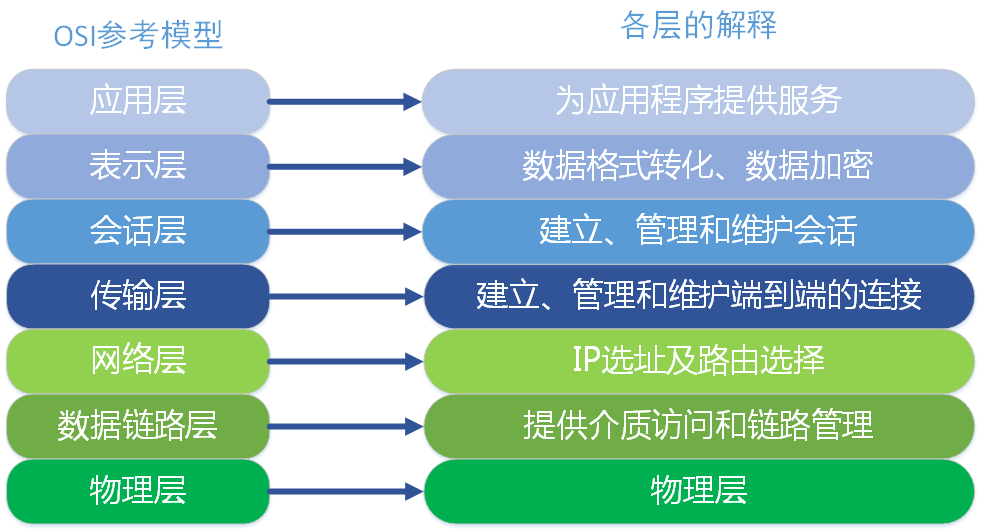

# osi七层模型

# 方向

发请求的时候是从上往下，接受请求从下往上

||||
|-|-|-|
|应用层|HTTP，HTTPS，FTP，POP3、SMTP|写的应用里面用的ajax XMLHttpRequest构造一段http请求|
|表示层|数据格式转换成通信中采用的标准表示形式，数据压缩和加密|
|会话层||
|传输层|TCP是http底层协议 UDP是websocket的底层协议|
|网络层|域名经过全球12台根域名服务器，转为IP地址|
|数据链路层| 将比特组合成字节,再将字节组合成帧,使用链路层地址 (以太网使用MAC地址)来访问介质,并进行差错检测，一台电脑进入互联网的唯一身份证|
|物理层|过物理介质传输比特流。规定了电平、速度和电缆针|

# 请求路径

> http://www.baidu.com?kw=123

> http://www.baidu.com ->通过网络层把域名地址解析门牌号IP地址-> 14.215.177.38

> 255.255.255.255

> 256四次方

