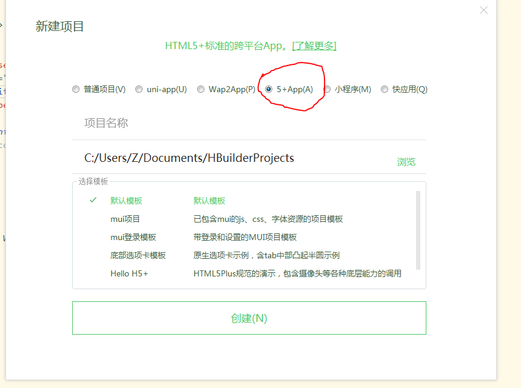
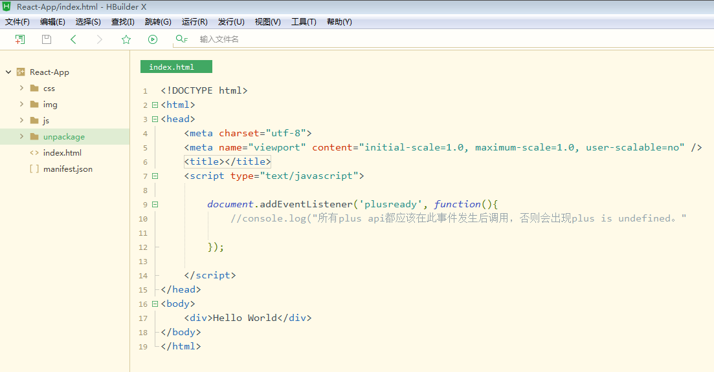

# 混合开发

界面层 用前端(html,css,js)
浏览器外壳(webview) Android和IOS

FaceBook

安卓(java)和IOS(oc)工程师先写好一个浏览器，而这个浏览器是应用的外套，它可以直接调用手机和电脑摄像头，录音和相册，文件读取，封装成一个新的DOM和BOM，因为界面的开发的成本是很高的

- Java
- Javascript(TS,ES6) HTML CSS

前端(html+css)负责界面
-
js
-

前端混合 另外一门客户端

React Native

# 外壳浏览器

# 安装

打开Hbuilder新建一个项目，初始化一个5+App下班过目

项目结构
- css
- js
- img
- unpackage 静态资源，logo，广告业，app生成的安装包
- index.html App进入看到的首页
- manifest.json 设置App的详细信息，比如图标，定位权限

