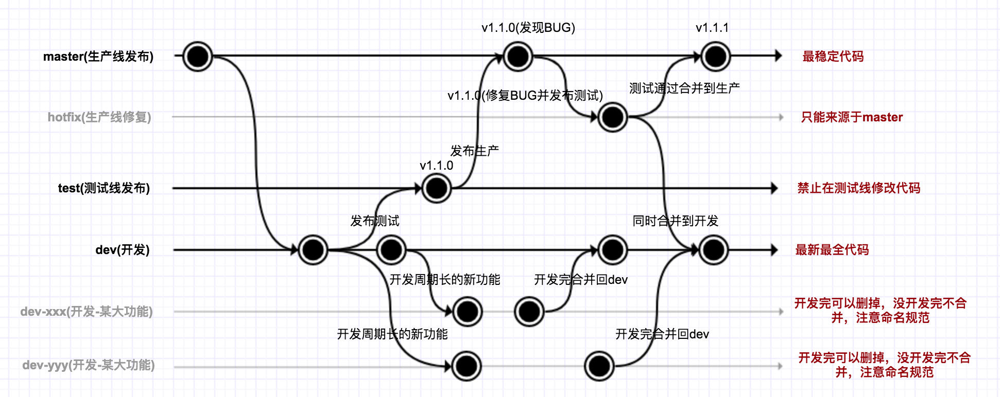

## git 基础

1. 代码推送 (常用指令, VS Code, 可视化工具)
2. 代码推送流程
3. 代码冲突

### 常用Git指令
```bash
# 提交
git add .
# 推送到本地
git commit -m "god is here"
# 拉取更新
git pull
# 推送到远程
git push

# 合并dev分支
git merge dev

```

### 代码推送流程
<p align="center">
  
</p>

### 常见问答
