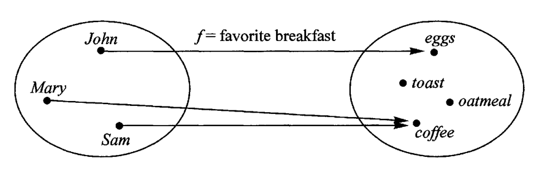

## 函子 functor

### 基础知识
1. 类 class

### 函子的概念(1)
1. 函子是函数式编程里面最重要的数据类型，也是基本的运算单位和功能单位。
2. 通过封装类class存储各种变量或函数, 在应用时可以通过传入不同的函数获得新的函子, 然后通过链式调用函子内部的函数, 达到快速处理数据的效果。


### 效果示例
```js
// 效果示例: 5 -> 5 + 5 -> 10 * 2
Functor.of(5).map(add5).map(double)
// 效果示例 - 2 -> 2 * 2 -> 4 * 3
Functor.of(2).map(double).map(add3)
```

### 概念图解
<p align="center">
  
</p>
上图中，左侧的圆圈就是一个函子，表示人名的范畴。外部传入函数f，会转成右边表示早餐的范畴。

### 完整示例
```js
class Functor {
    constructor (value) {
        this.value = value;
    }      
    map (fn) {
        return Functor.of(fn(this.value))
    }
}

Functor.of = function (val) {
    return new Functor(val);
}

function add5(val) {
    return val + 5
}

function double(val) {
    return val * 2
}

Functor.of(1); //-> Functor {value: 1}
Functor.of(1).value; //-> 1
Functor.of(1).map(add5); //-> Functor {value: 6}
Functor.of(1).map(add5).value; //-> 6
Functor.of(1).map(add5).map(double); //-> Functor {value: 12}
Functor.of(1).map(add5).map(double).value; //-> 12

Functor.of(1).map(double).map(add5).value; //-> 7
```


