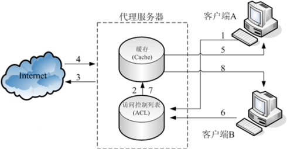

## 浏览器和网络

### 参考资料

```bash
代理和反向代理 - 基本概念
https://www.jianshu.com/p/2fea47963915
输入url到浏览器显示页面的过程
https://blog.csdn.net/qq_24147051/article/details/81115806


```


### http常识

```bash
# 默认端口号
http://123.com:80
https://123.com:443
sftp://123.com:22

# 项目跨域搭配
开发环境：前端基于服务器代理(http proxy)实现跨域请求
生产环境：后端nginx反向代理
```

### 代理和反向代理图解
1. 最原始的代理服务器的代理是指充当客户端的“代理”。
2. Web服务器的代理则被称为反向代理服务器。（反向的含义是以前代理客户端，现在代理服务端）
3. 反向代理服务器对外屏蔽了真实的服务器，并且作为服务端的出入口，我们可以在反向代理服务器上添加策略：比如Web攻击防护策略、CC攻击防护策略等。
<p align="center">
  
</p>

<p align="center">
  
</p>


### 网络 - 浏览器访问一个url, 展示页面的详细流程
```bash
#
1. 输入网址
2. 缓存解析
3. 域名解析
4. tcp连接，三次握手
5. 服务器收到请求
6. 浏览器接收数据, 渲染页面, 生成Dom树, 解析css样式, 进行js交互。

# 拓展: 如何提升网页加载速度 ?

```


### 网络 - DNS详细过程, TCP三次握手, UDP, 网络分层
```bash
#

```


### 网络 - 强缓存, 协商缓存, 缓存涉及的headers
```bash
#

```


### 网络 - HTTP1.0, HTTP1.1, HTTP2
```bash
#

```


### 网络 - 重绘重排
```bash
# 回流和重绘, 基础概念
https://www.jianshu.com/p/e081f9aa03fb

#

```


### 网络 - script标签为什么放在页面的底部
```bash
#
1. 防止DOM节点还未加载完成就执行函数
2. 

```


